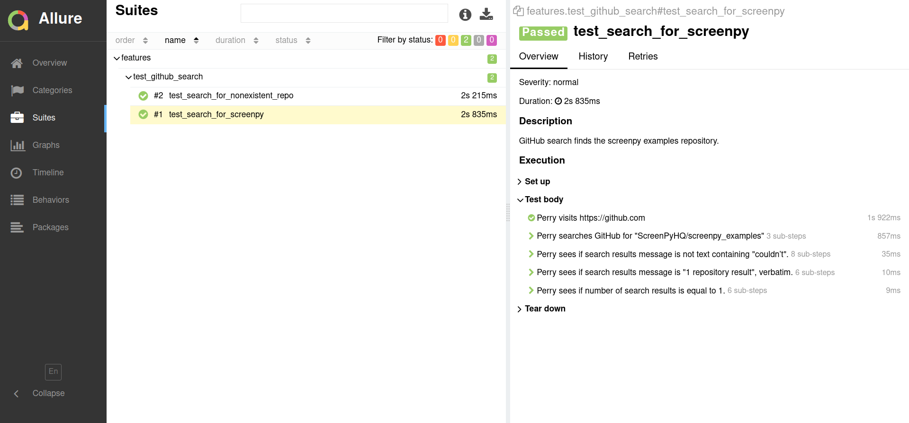
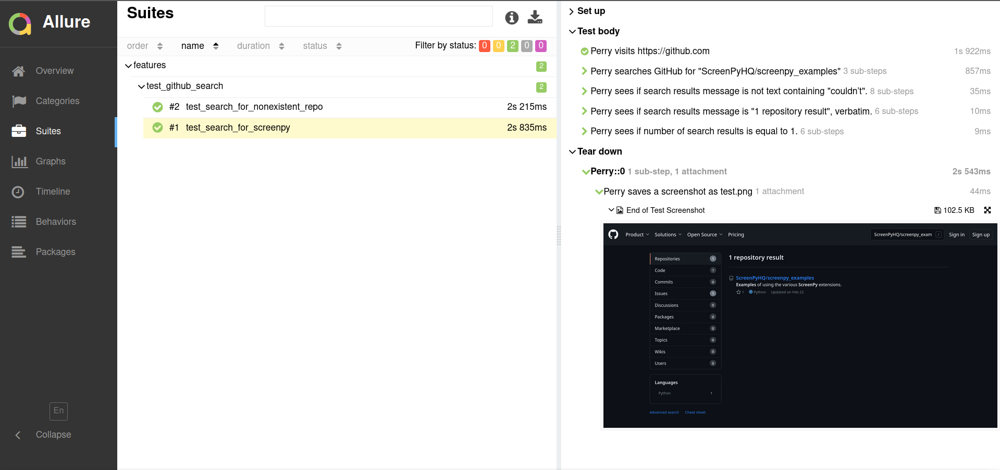

=======
Recipes
=======

This plugin is an adapter for the microphone of ScreenPy's Narrator which sends logs to Allure.

This `example <https://github.com/ScreenPyHQ/screenpy_examples/tree/trunk/screenpy_selenium/github>`__ makes use of this plugin.

Plugging In the Adapter
=======================

Plugging the ``AllureAdapter``
into the :external+screenpy:ref:`Narrator <narration>`'s microphone
must be done during test setup.
This will be in your ``conftest.py`` file for `pytest <https://docs.pytest.org/>`__,
or during suite configuration for `unittest <https://docs.python.org/3/library/unittest.html>`__.

Either way,
the steps are the same,
wherever you need to do them::

    from screenpy.pacing import the_narrator
    from screenpy_adapter_allure import AllureAdapter

    the_narrator.attach_adapter(AllureAdapter())

After that the steps are attached to the allure report

Attach Screenshot from Selenium
===============================

If you are using allure in a Selenium project using :external+screenpy_selenium:doc:`ScreenPy Selenium <index>`

You can attach a new screenshot to the report using the action :external+screenpy_selenium:class:`~screenpy_selenium.actions.SaveScreenshot`

For example you can attach an screenshot as PNG::

    from screenpy import Actor
    from allure_commons.types import AttachmentType

    filepath = 'screenshot.png'

    the_actor = Actor.named("Perry").who_can(BrowseTheWeb.using_firefox())

    the_actor.attempts_to(
        SaveScreenshot.as_(filepath).and_attach_it_with(
            attachment_type=AttachmentTypes.PNG,
        ),
    )

In the `github example <https://github.com/ScreenPyHQ/screenpy_examples/blob/trunk/screenpy_selenium/github/features/test_github_search.py#L44-L54>`__,
we go to the github page
and find the ``screenpy_examples`` repository

